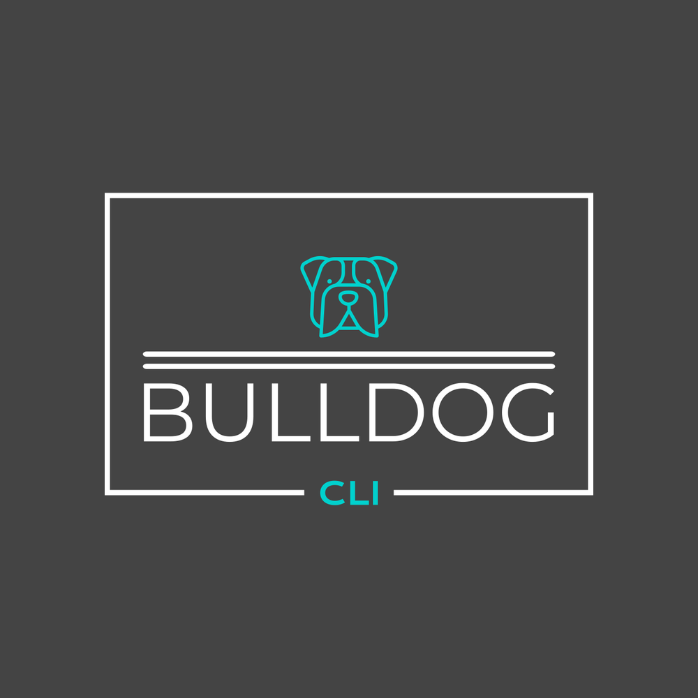

<!-- Improved compatibility of back to top link: See: https://github.com/jepifanio90/bulldog-cli/pull/73 -->
<a name="readme-top"></a>
[![Contributors][contributors-shield]][contributors-url]
[![Forks][forks-shield]][forks-url]
[![Stargazers][stars-shield]][stars-url]
[![Issues][issues-shield]][issues-url]
[![MIT License][license-shield]][license-url]
[![BulldogAnalysis][bldg-analysis-shield]][bldg-analysis-url]
[![BulldogLinter][bldg-linter-shield]][bldg-linter-url]
[![BulldogSecurity][bldg-security-shield]][bldg-security-url]
[![BulldogTest][bldg-test-shield]][bldg-test-url]
[![Go Report Card][goreport-shield]][goreportcard-url]


<!-- PROJECT LOGO -->
<br />
<div align="center">
  <a href="https://github.com/jepifanio90/bulldog-cli">
    
  </a>

<h3 align="center">Bulldog CLI</h3>

  <p align="center">
    Bulldog is a CLI that empowers developers by giving them full control over their cloud accounts and pipelines
    <br />
    <a href="https://github.com/jepifanio90/bulldog-cli"><strong>Explore the docs »</strong></a>
    <br />
    <br />
    <a href="https://github.com/jepifanio90/bulldog-cli/issues">Report Bug</a>
    ·
    <a href="https://github.com/jepifanio90/bulldog-cli/issues">Request Feature</a>
  </p>
</div>

<!-- TABLE OF CONTENTS -->
<details>
  <summary>Table of Contents</summary>
  <ol>
    <li>
      <a href="#about-the-project">About The Project</a>
    </li>
    <li>
      <a href="#getting-started">Getting Started</a>
      <ul>
        <li><a href="#prerequisites">Prerequisites</a></li>
        <li><a href="#installation">Installation</a></li>
      </ul>
    </li>
    <li><a href="#roadmap">Roadmap</a></li>
    <li><a href="#contributing">Contributing</a></li>
    <li><a href="#license">License</a></li>
  </ol>
</details>


<!-- ABOUT THE PROJECT -->

## About The Project

[](.github/media/demo.gif)

Bulldog CLI pulls your resources from different cloud providers (AWS, Google, Azure + more to come) and your CI/CD
pipelines (Circle CI, Travis and Github Actions) and displays that data in a nice table format.

<p align="right">(<a href="#readme-top">back to top</a>)</p>

<!-- GETTING STARTED -->

## Getting Started

This is an example of how you may give instructions on setting up your project locally.
To get a local copy up and running follow these simple example steps.

### Prerequisites

For now you'll need the following installed in your local:

- awscli
- glcoud
- az (azure cli)
- travis

### Installation

In progress...

[//]: # (* Brew)

[//]: # (  ```sh)

[//]: # (  brew install bulldog-cli)

[//]: # (  ```)

<!-- ROADMAP -->

## Roadmap

- [x] Tenant Command
    - [x] Add list sub command
        - [X] Add `cloud` flag
        - [x] Add `pipelines` flag
        - [ ] Add `hosts` flag

See the [open issues](https://github.com/jepifanio90/bulldog-cli/issues) for a full list of proposed features (and known
issues).

<p align="right">(<a href="#readme-top">back to top</a>)</p>


<!-- CONTRIBUTING -->

## Contributing

Contributions are what make the open source community such an amazing place to learn, inspire, and create. Any
contributions you make are **greatly appreciated**.

If you have a suggestion that would make this better, please fork the repo and create a pull request. You can also
simply open an issue with the tag "enhancement".
Don't forget to give the project a star! Thanks again!

1. Fork the Project
2. Create your Feature Branch (`git checkout -b feature/AmazingFeature`)
3. Commit your Changes (`git commit -m 'Add some AmazingFeature'`)
4. Push to the Branch (`git push origin feature/AmazingFeature`)
5. Open a Pull Request

<p align="right">(<a href="#readme-top">back to top</a>)</p>


<!-- LICENSE -->

## License

Distributed under the MIT License. See `LICENSE` for more information.

<p align="right">(<a href="#readme-top">back to top</a>)</p>


<!-- MARKDOWN LINKS & IMAGES -->
<!-- https://www.markdownguide.org/basic-syntax/#reference-style-links -->

[contributors-shield]: https://img.shields.io/github/contributors/jepifanio90/bulldog-cli.svg?style=for-the-badge

[contributors-url]: https://github.com/jepifanio90/bulldog-cli/graphs/contributors

[forks-shield]: https://img.shields.io/github/forks/jepifanio90/bulldog-cli.svg?style=for-the-badge

[forks-url]: https://github.com/jepifanio90/bulldog-cli/network/members

[stars-shield]: https://img.shields.io/github/stars/jepifanio90/bulldog-cli.svg?style=for-the-badge

[stars-url]: https://github.com/jepifanio90/bulldog-cli/stargazers

[issues-shield]: https://img.shields.io/github/issues/jepifanio90/bulldog-cli.svg?style=for-the-badge

[issues-url]: https://github.com/jepifanio90/bulldog-cli/issues

[license-shield]: https://img.shields.io/github/license/jepifanio90/bulldog-cli.svg?style=for-the-badge

[license-url]: https://github.com/jepifanio90/bulldog-cli/blob/master/LICENSE.txt

[bldg-analysis-shield]: https://img.shields.io/github/actions/workflow/status/jepifanio90/bulldog-cli/analysis.yml?label=Bulldog%20Analysis&style=for-the-badge

[bldg-linter-shield]: https://img.shields.io/github/actions/workflow/status/jepifanio90/bulldog-cli/linter.yml?label=Bulldog%20Linter&style=for-the-badge

[bldg-security-shield]: https://img.shields.io/github/actions/workflow/status/jepifanio90/bulldog-cli/security.yml?label=Bulldog%20Security&style=for-the-badge

[bldg-test-shield]: https://img.shields.io/github/actions/workflow/status/jepifanio90/bulldog-cli/test.yml?label=Bulldog%20Test&style=for-the-badge

[bldg-analysis-url]: https://github.com/JEpifanio90/bulldog-cli/actions/workflows/analysis.yml

[bldg-linter-url]: https://github.com/JEpifanio90/bulldog-cli/actions/workflows/linter.yml

[bldg-security-url]: https://github.com/JEpifanio90/bulldog-cli/actions/workflows/security.yml

[bldg-test-url]: https://github.com/JEpifanio90/bulldog-cli/actions/workflows/test.yml

[goreport-shield]: https://img.shields.io/badge/go%20report-A+-brightgreen.svg?style=for-the-badge

[goreportcard-url]: https://goreportcard.com/report/github.com/jepifanio90/bulldog-cli
